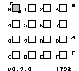
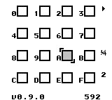
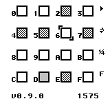

# Granular (Game Boy ROM)

<!-- 
 -->
<!--  -->
<!-- 
 -->

An experimental ROM inspired by [granular synthesis](https://en.wikipedia.org/wiki/Granular_synthesis), designed for generating noise / chiptune textures.

## Controls

- `Start` - Play / Stop
- `Start` + `Select` - Play / Stop in loop mode
- `Up` / `Down` / `Left` / `Right` - Cursor movement
- `A` - Enable / Disable cell under the cursor
- `Select` + `Right` / `Left` - Increase / Decrease grain size
- `Select` + `Up` / `Down` - Increase / Decrease speed
- `B` + `Right` / `Left` - Increase / Decrease period value
- `B` + `Up` / `Down` - Increase / Decrease period value by 100

## Build from source (Linux)

1. Clone the repository.
2. Build the ROM from source code using the `make` command.

## Screenshots

## Special Thanks

- [GBDK-2020](https://github.com/gbdk-2020/gbdk-2020)
- [Pan Docs](https://gbdev.io/pandocs/)
- [Gameboy Development Forum](https://gbdev.gg8.se/forums/index.php)
